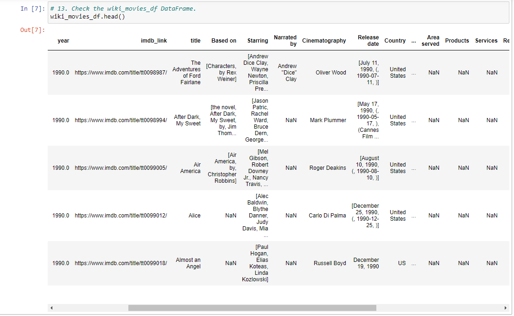

# Movies-ETL

## Overview
For this project we employed the data pipeline process known as extract, transform and load to perform data wrangling on Wikipedia data for all movies released since 1990 and ratings data from MovieLens.  The purpose of this project was to transform messy data into clean data that could be used by the ficticious company Amazing PrimeWe to create an algorithim for predicting which low budget films being released will become popular.  For this project, we used python and pandas to perform our data wrangling and PostgreSQL to store the finsihed data.
## Results
The movies data from wikipedia was provided to us in .csv format which we imported into jupyter notebook and created a dataframe to view all of the data; A portion of that dataframe can be seen in the image below.  When we examined the dataframe, we found that there was a lot of work necessary to clean this data up before it could be useful.  Looking at the 'year' column we see that the values in this column are carrying a decimal which means that all the values in this column are not in integer form.  When we look at the 'Release date' column, we can see that the format of the dates is inconsistent from row to row and some rows contain information in addition to the date.  Similarly, in the 'Country' column we see that for some rows the country name is spelled out while in other rows only the country abbreviation appears.  Furthermore, we can see that many rows and columns are missing data which are represented by 'NaN' in our dataframe.

The ratings data from MovieLens was provided to us in a JSON file which we performed the extract, transform and load process on similarly to the movies data.
## Summary
After we extracted the data from the .csv and JSON files, we took the messy data and transformed it into clean usable data and finally we loaded it into a database.  We can see a portion of that database with the clean data in the image below.  When we examine this database we find that the data in each column is much more consistent and we have less missing values.  The 'release_date' column contains dates that are all in the same format.  When we compare the 'country' column from our original dataframe to the 'country' column in our database we can see that the format is the same for the whole column and there is no longer a mix of country names and country abbreviations.  

With this movie data and the ratings data now cleaned and loaded into our PostgreSQL database we have usable data that is ready to be analyzed by Amazing Prime to develop their algorithm for determining which low budget films will become popular.